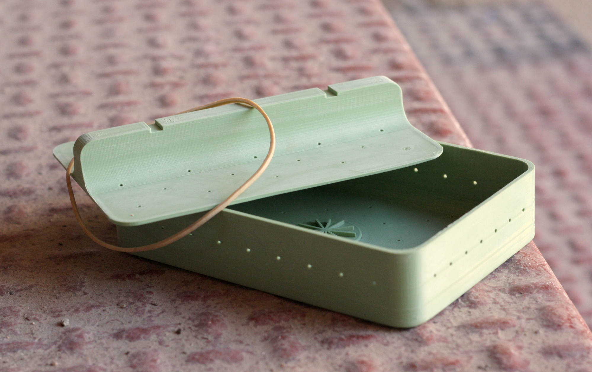
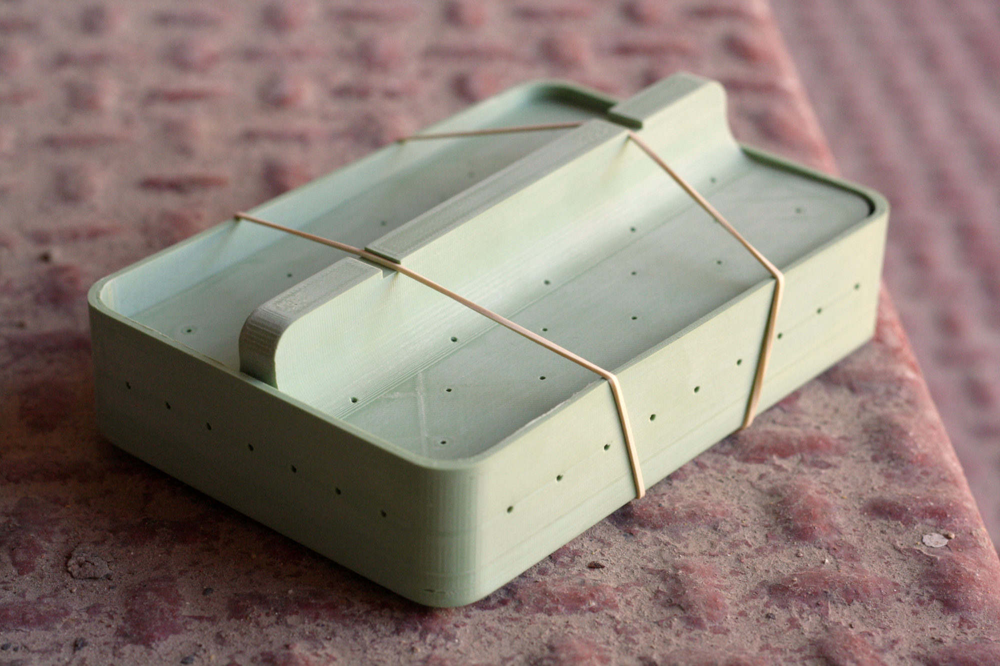
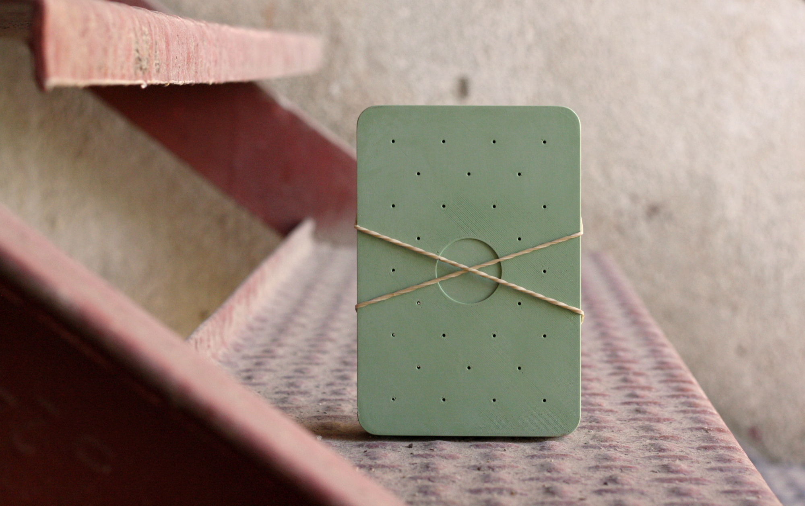
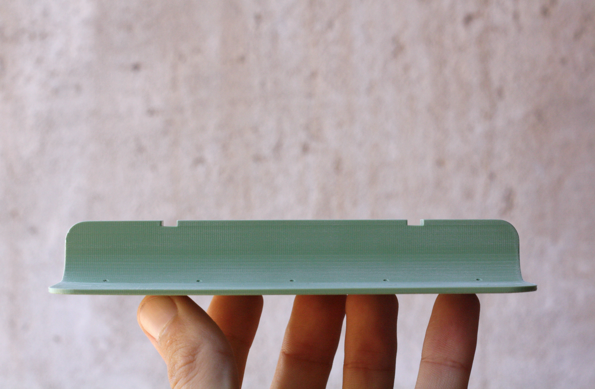
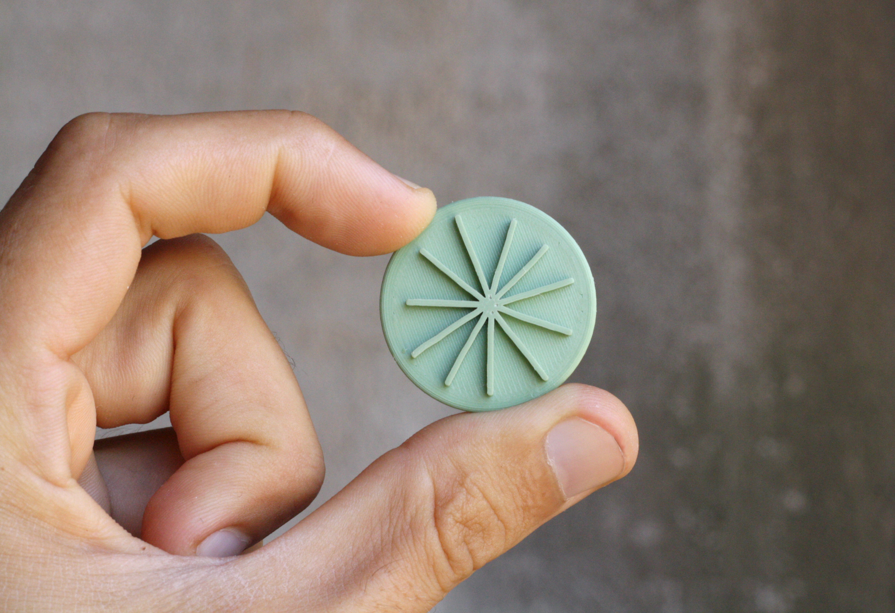
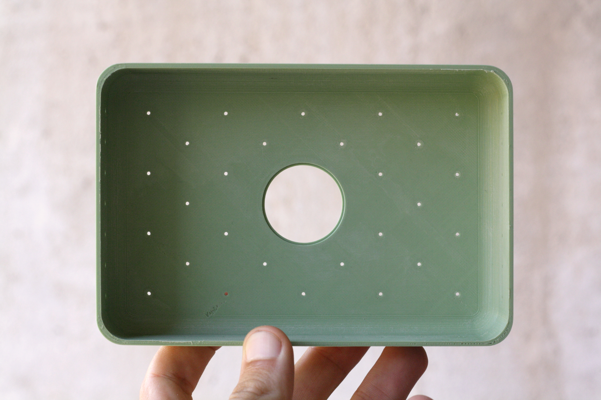
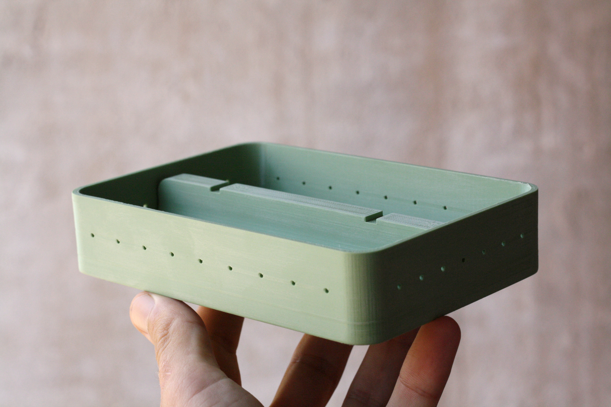
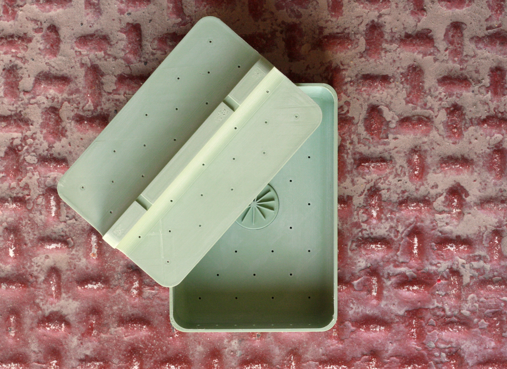

# Tempeh moulds v-02

This repository contains the source files second version of the rectangle moulds we created to shape our tempeh's.

Please, send us some pictures!

Domingo Club → [domingoclub.com](https://domingoclub.com) & [instagram.com/domingoclub](https://instagram.com/domingoclub/)
